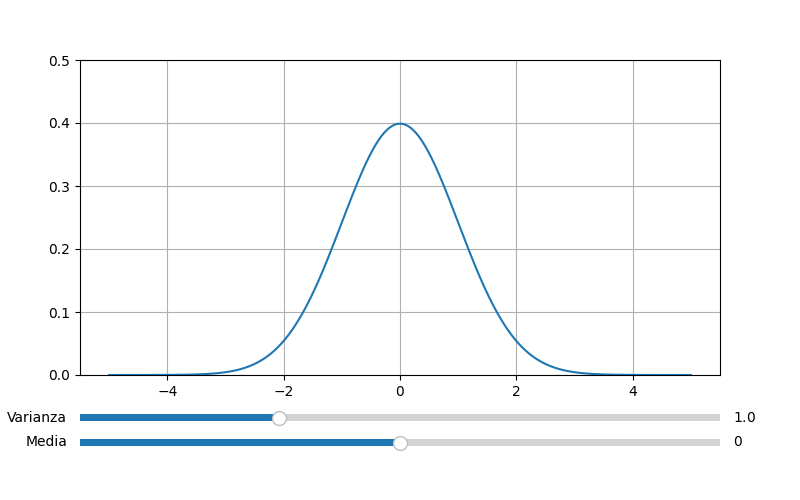

# Distribuzione Normale di Gauss

La distribuzione normale dipende da due parametri, la media $\mu$ e la varianza $\sigma^2$, ed è indicata tradizionalmente con: $$N(\mu, \sigma^2)$$

Inoltre è caratterizzata dalla seguente funzione di densità di probabilità: $$f(x) = \frac{1}{\sigma\sqrt{2\pi}} e^{-\frac{(x - \mu)^2}{2\sigma^2}}, \ \ \ x \in \mathbb{R}$$

La rappresentazione grafica della distribuzione normale è la seguente:

<p align="center">
	
</p>

Per maggiori informazioni consultare la pagina di Wikipedia: https://it.wikipedia.org/wiki/Distribuzione_normale

# Utilizzo del software di simulazione

Prima di tutto devi clonare la repository nel tuo computer.
Se non sai in che posizione mettere il progetto, puoi scegliere il **Dektop** per semplicità.
Quindi usa il comando:

```shell
[Desktop]$ git clone https://github.com/AntonioBerna/gauss-distribution.git
```

Benissimo! Accedendo alla cartella ```gauss-distribution``` creiamo un ambiente virtuale con il seguente comando:

```shell
[gauss-distribution]$ virtualenv venv
```

> **NOTA:** ```venv``` è il nome dell'ambiente virtuale, puoi scegliere il nome che preferisci!

Il prossimo passo è attivare l'ambiente virtuale appena creato:

```shell
[gauss-distribution]$ source venv/bin/activate
```

>**NOTA**: anche in questo caso al posto di ```venv``` devi mettere il nome del tuo ambiente virtuale! (non lo ripeterò più)

Ora bisogna installare le dipendenze per far funzionare il software di simulazione con il comando:

```
(venv) [gauss-distribution]$ pip install -r requirements.txt
```

Nella repository ti ho fornito un ```Makefile``` che ti permetterà di creare l'eseguibile, in particolare devi scrivere:

```shell
(venv) [gauss-distribution]$ make
```

Al termine del processo verrano creati alcuni file e cartelle.
In particolare accedendo alla cartella ```dist/``` troverai l'eseguibile. Quindi scrivendo il comando:

```shell
(venv) [dist]$ ./pippo
```

si avvierà il software di simulazione.

> **NOTA:** come possiamo notare l'eseguibile si chiama ```pippo``` ma è possibile cambiare il nome accedendo al ```Makefile``` e cambiando l'etichetta ```TARGET```. Per esempio ```TARGET=cavallo```.

# Per maggiori informazioni

Spiegazione online Distribuzione Normale di Gauss con Python (vecchio codice): https://www.youtube.com/watch?v=2_sL1sfnRvk&t=239s


Created By Antonio Bernardini Copyright© 2023
